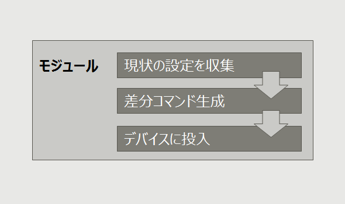

<!-- markdownlint-disable MD001 -->
<!-- markdownlint-disable MD012 -->
<!-- markdownlint-disable MD036 -->

# Ansibleローカルモジュール

<br><br>

##### Takamitsu IIDA (@takamitsu-iida)

---

## ネットワーク系モジュール

設定を変更するモジュールは次の動作を行う

1. リモートデバイスに接続
1. 設定情報を採取
1. 差分設定を生成
1. リモートデバイスに設定を投入

---

## ネットワーク系モジュール

- モジュールの中で全ての処理を完結



---

## 装置がないと利用できない

- 事前に検証機器が必要
- 以前採取したコンフィグを持っていても活用できない

---

## 入力パラメータがイマイチ

- 複数の状態をモジュールに入力するのに使う **aggregate** 指定がちょっと分かりづらい

---

## ネットワーク機器の設定

ある意味、特殊な文化

- デフォルトの設定は表示されない
- noを付けると設定が消える（デフォルトの状態に戻る）

---

## 一方でAnsibleの文化は

- state: present　-> その状態がある
- state: absent -> その状態が存在しない
- 同時には指定できない

あるパラメータはデフォルトのままが正、あるパラメータは値を変更する、というのを表現したい

---

## こうあってほしい


---

## ローカルモジュール

- コアモジュールの改造は難しそう
- 差分コマンドを生成するだけのモジュールを作成

<br>

- リモートデバイスに接続しないのでここでは**ローカルモジュール**と呼ぶ

---

## プレイブック利用


---

## モジュールへの入力（１）

### 装置の設定情報を入力

- **running_config** 既存の設定を文字列で指定
- **running_config_path** ファイルを指定

```yaml
tasks:
  - name: create config to be pushed
    ios_interface_local:
      running_config: "{{ running_config }}"
      interfaces: "{{ interfaces }}"
    register: r
```

---

## モジュールへの入力（２）

### 希望する状態をYAMLで入力

- リストなので同時に複数を指定可能

```yaml
interfaces:

  - name: GigabitEthernet3
    description: configured by ansible
    mtu: 1500
    shutdown: false
    state: present
```

---

## モジュールへの入力（３）

### デフォルト状態をpresentで表現

- 値を持たないキーはデフォルトの状態であることを意味する

```yaml
interfaces:

  - name: GigabitEthernet3
    speed:
    mtu:
    state: present
```

mtuやspeedは装置に設定が入っていればnoで消された状態になる

---

## モジュールからの出力

- **commands** 流し込むコマンドをリストで返却

```bash
"commands": [
    "interface GigabitEthernet3",
    "no description",
    "description configured by ansible",
    "mtu 1512",
    "interface GigabitEthernet4",
    "no negotiation auto",
    "speed 1000",
    "interface Loopback0",
    "description configured by ansible",
    "shutdown"
]
```

---

## 装置に流し込むには

- ios_configモジュールではなくios_cfgを使うこと
- ios_cfgは親子関係関係なく流し込みます

---

## 大切なこと

### 必要な機能を持ったモジュールを作れること

- ニーズを満たすモジュールなんてそうそう落ちてない
- モジュールの作り方を体系的にまとめたい
